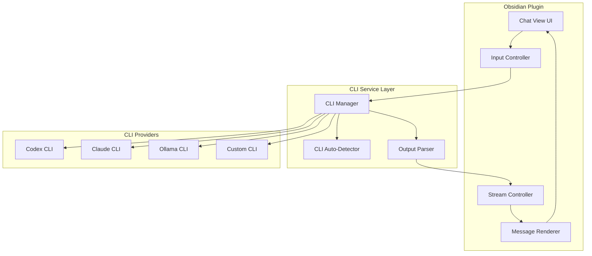

# Multi-Provider CLI Chat Plugin for Obsidian

## Overview

Fork Claudian and refactor it from Claude Agent SDK to direct CLI execution, enabling support for multiple AI providers (Codex, Claude, Ollama, and custom CLIs) while preserving the polished chat UI.

## Architecture




## Key Changes from Claudian

### What to Keep (UI Layer)

- `src/features/chat/` - Chat view, tabs, message rendering
- `src/features/settings/` - Settings UI (modified)
- `src/shared/` - Shared UI components
- `src/style/` - All CSS styling
- `src/i18n/` - Internationalization

### What to Replace (Service Layer)

- `src/core/agent/ClaudianService.ts` - Replace with `CLIService.ts`
- `src/core/agent/QueryOptionsBuilder.ts` - Remove (SDK-specific)
- `src/core/agent/MessageChannel.ts` - Remove (SDK-specific)
- `@anthropic-ai/claude-agent-sdk` dependency - Remove entirely

### What to Modify

- `src/utils/claudeCli.ts` - Expand to multi-CLI detection
- `src/core/types/settings.ts` - Add provider selection and multi-CLI paths
- `src/features/chat/controllers/InputController.ts` - Simplify for direct CLI
- `src/features/chat/controllers/StreamController.ts` - Parse CLI stdout

## CLI Command Formats


| Provider | Non-Interactive Command     | Key Flags                                  |
| -------- | --------------------------- | ------------------------------------------ |
| Codex    | `codex exec "prompt"`       | `--yolo`, `--cd path`, `--model`, `--json` |
| Claude   | `claude "prompt"`           | Direct text output                         |
| Ollama   | `ollama run model "prompt"` | Model selection                            |
| Custom   | User-defined                | User-defined args                          |


### Codex CLI Integration

Codex CLI supports non-interactive mode via `codex exec`:

```bash
# Basic usage
codex exec "your prompt here"

# With options
codex exec --yolo --cd /path/to/vault "edit this text"

# JSON output for parsing
codex exec --json "summarize this"
```

## Implementation Plan

### Phase 1: Fork and Clean

1. Copy Claudian to new project directory
2. Remove Claude Agent SDK dependency from `package.json`
3. Remove SDK-specific files:
  - `src/core/agent/MessageChannel.ts`
  - `src/core/agent/QueryOptionsBuilder.ts`
  - `src/core/agent/SessionManager.ts`
  - `src/core/sdk/` directory
4. Update `manifest.json` with new plugin ID and name

### Phase 2: CLI Service Layer

Create new CLI execution layer in `src/core/cli/`:

`**CLIService.ts**` - Main service replacing ClaudianService:

```typescript
interface CLIConfig {
  provider: 'codex' | 'claude' | 'ollama' | 'custom';
  path: string;
  args?: string[];
}

class CLIService {
  async *query(prompt: string, config: CLIConfig): AsyncGenerator<StreamChunk>;
  cancel(): void;
}
```

`**CLIDetector.ts**` - Auto-detect installed CLIs:

```typescript
function findCodexCLI(): string | null;
function findClaudeCLI(): string | null;
function findOllamaCLI(): string | null;
function detectAvailableCLIs(): CLIInfo[];
```

`**OutputParser.ts**` - Parse CLI stdout to stream chunks:

```typescript
function parseCodexOutput(stdout: string): StreamChunk[];
function parseClaudeOutput(stdout: string): StreamChunk[];
function parseOllamaOutput(stdout: string): StreamChunk[];
```

### Phase 3: Settings Integration

Modify `src/core/types/settings.ts`:

```typescript
interface PluginSettings {
  // Provider selection
  defaultProvider: 'codex' | 'claude' | 'ollama' | 'custom';
  
  // CLI paths (per hostname)
  codexCliPathsByHost: Record<string, string>;
  claudeCliPathsByHost: Record<string, string>;
  ollamaCliPathsByHost: Record<string, string>;
  customCliCommand: string;
  
  // Provider-specific settings
  codexModel?: string;
  codexSandbox?: 'read-only' | 'workspace-write';
  ollamaModel?: string;
  
  // Preserved settings
  userName: string;
  excludedTags: string[];
  // ... other UI preferences
}
```

Update `src/features/settings/ClaudianSettings.ts`:

- Add provider dropdown selector
- Add CLI path inputs for each provider
- Add auto-detect buttons
- Add provider-specific settings sections

### Phase 4: Adapt Chat Controllers

`**InputController.ts**` modifications:

- Replace SDK query calls with CLIService calls
- Remove tool use handling (simplified for text)
- Keep slash commands, @-mentions for context

`**StreamController.ts**` modifications:

- Replace SDK message transform with CLI output parsing
- Simplify chunk types (mainly text, done, error)
- Keep streaming display logic

### Phase 5: Simplify Features

Remove or simplify SDK-dependent features:

- Remove: MCP server integration (SDK feature)
- Remove: Tool use rendering (Bash, file ops)
- Remove: Plan mode (SDK feature)
- Remove: Subagent management (SDK feature)
- Keep: Chat UI, message history, file context (@-mentions)
- Keep: Slash commands, selection highlight, keyboard nav

## File Structure After Refactor

```
src/
├── core/
│   ├── cli/
│   │   ├── CLIService.ts          # Main CLI execution
│   │   ├── CLIDetector.ts         # Auto-detect CLIs
│   │   ├── OutputParser.ts        # Parse CLI output
│   │   └── types.ts               # CLI types
│   ├── storage/                   # Keep for settings/history
│   └── types/
│       └── settings.ts            # Extended for multi-CLI
├── features/
│   ├── chat/                      # Keep UI mostly unchanged
│   │   ├── ClaudianView.ts
│   │   ├── controllers/
│   │   ├── rendering/
│   │   ├── tabs/
│   │   └── ui/
│   └── settings/                  # Modified for providers
├── shared/                        # Keep
├── style/                         # Keep
├── i18n/                          # Keep (update strings)
└── utils/
    ├── cliDetector.ts             # Renamed/expanded
    └── path.ts                    # Keep
```

## Testing Strategy

1. **Manual Testing**: Install plugin, configure each CLI, verify chat works
2. **CLI Detection**: Test auto-detection on Windows, macOS, Linux
3. **Streaming**: Verify response streaming displays correctly
4. **Error Handling**: Test CLI not found, timeout, permission errors

## Estimated Complexity


| Component          | Lines Changed | Effort |
| ------------------ | ------------- | ------ |
| Remove SDK code    | -3000         | Low    |
| CLI Service        | +500          | Medium |
| Settings changes   | +200          | Low    |
| Controller updates | +300          | Medium |
| UI cleanup         | +100          | Low    |


**Net result**: Significantly simpler codebase (remove ~2000 lines)